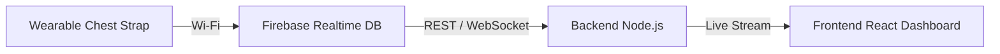

# 🏃 AthletiSense: IoT Athletic Performance Ecosystem

AthletiSense is a comprehensive, real-time sports performance monitoring ecosystem. It consists of a **Wearable Chest Strap** that collects high-fidelity biometric and kinematic data, and a **Performance Dashboard** for coaches and athletes to visualize live telemetry and historical trends.


---

## 🏗️ System Architecture



1.  **Wearable Device**: ESP32-C3 powered chest strap collects ECG, IMU, Temp, and Strain data.
2.  **Cloud Layer**: Firebase acts as a real-time data bridge and persistent storage.
3.  **Backend**: Node.js/Express server providing standardized APIs and WebSocket streaming.
4.  **Frontend**: React-based dashboard with responsive charts, role-based access, and alerts.

---

## 👕 Wearable Chest Strap (Hardware)

### ✨ Key Features
- **❤️ Heart Rate (ECG):** AD8232 sensor for precise electrical heart activity and BPM calculation.
- **🏃 Motion Tracking:** BMI160 6-axis IMU for acceleration, gyroscope, and step counting.
- **🌡️ Skin Temperature:** DS18B20 digital sensor for accurate body temperature monitoring.
- **🦾 Muscle/Joint Strain:** BF350 Strain Gauge to monitor breathing rate or physical exertion.
- **📺 On-board OLED:** Live status updates (Vitals, Motion, System) directly on the device.

### 🛠️ Hardware Specifications
| Component | Function | Interface / Pins |
| :--- | :--- | :--- |
| **ESP32-C3 Mini-1** | Main Microcontroller | - |
| **AD8232** | ECG Activity | Analog (`GPIO 34`, `LO+ = 32`, `LO- = 33`) |
| **BF350** | Breathing/Strain | Analog (`GPIO 3`) |
| **BMI160** | IMU + Steps | I2C (`SDA=8`, `SCL=9`, Addr: `0x69`) |
| **DS18B20** | Temperature | OneWire (`GPIO 2`) |
| **SSD1306** | 0.96" OLED | I2C (`SDA=8`, `SCL=9`, Addr: `0x3C`) |

---

## 📱 Performance Dashboard (Software)

### 👥 Role-Based Access
- **Head Coach / Physiotherapist**: Full access to all athlete data and comparative analytics.
- **Athletes**: Private access to personal performance logs and live vitals.

### 📊 Tech Stack
- **Frontend**: React 18, Vite, Tailwind CSS, Recharts, Lucide React.
- **Backend**: Node.js, Express, WebSocket (`ws`), `firebase-admin`.

---

## 🚀 Getting Started

### 1️⃣ Firmware Setup (Hardware)
1.  Open `/src/esp32_sensors_firebase.ino` in Arduino IDE.
2.  Install Required Libraries: `BMI160-Arduino`, `OneWire`, `DallasTemperature`, `Firebase ESP32 Client`.
3.  Update `Config` namespace with your Wi-Fi and Firebase credentials.
4.  Flash to **ESP32-C3**.

### 2️⃣ Dashboard Setup (Software)
#### Install Dependencies

```bash
# Backend
cd backend && npm install

# Frontend
cd ../frontend && npm install
```

#### Start the Services
```bash
# Terminal 1: Backend
cd backend && npm start

# Terminal 2: Frontend
cd frontend && npm run dev
```


## 📡 REST API Endpoints

| Method | Endpoint | Description |
|--------|----------|-------------|
| GET | `/api/athletes` | List all athletes + latest record |
| GET | `/api/athletes/:id` | Full history for one athlete |
| GET | `/api/athletes/:id/latest` | Latest reading |
| GET | `/api/summary` | Aggregated stats for all athletes |

---

## 🔌 WebSocket Events

Connect to `ws://localhost:3001`

| Event | Direction | Description |
|-------|-----------|-------------|
| `snapshot` | Server → Client | Initial full data on connect |
| `live_update` | Server → Client | New reading every 4 seconds |

---

## 🔥 Firebase Integration (Future)

When ready to switch from CSV to Firebase Realtime Database, replace the data layer in `backend/server.js`:

```javascript
// Install Firebase Admin SDK
// npm install firebase-admin

const admin = require('firebase-admin');
admin.initializeApp({ credential: admin.credential.applicationDefault() });
const db = admin.database();

// Replace CSV loading with:
const snapshot = await db.ref('athletes').once('value');
const data = snapshot.val();

// For real-time streaming, use Firebase listeners:
db.ref('athletes/ATH_001/readings').on('child_added', (snap) => {
  const newReading = snap.val();
  // broadcast to WebSocket clients
  wss.clients.forEach(client => {
    client.send(JSON.stringify({ type: 'live_update', data: [newReading] }));
  });
});
```

---

## 📱 Responsive Design

The dashboard is fully responsive:
- **Desktop**: Full sidebar + multi-column grid
- **Tablet**: Collapsible sidebar, 2-column grid
- **Mobile**: Hamburger menu, single column

