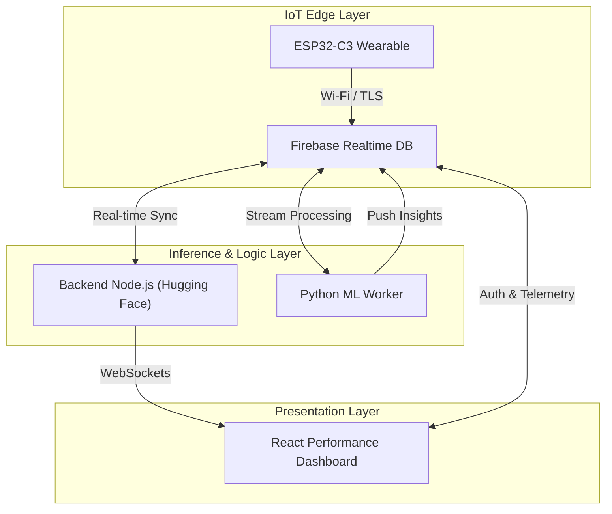

# 🏃 AthletiSense: IoT Athletic Performance Ecosystem

[](#)
[](#)
[](https://opensource.org/licenses/MIT)

**AthletiSense** is a professional-grade, end-to-end IoT ecosystem designed for high-performance athletic monitoring. It bridges the gap between raw physiological telemetry and actionable coaching insights by combining custom wearable hardware, real-time cloud synchronization, and advanced machine learning inference.

---

## 🌟 The Vision

AthletiSense empowers coaches and athletes with a "Digital Twin" of physiological performance. By monitoring multi-dimensional data—from ECG-grade heart rate and 6-axis motion to respiratory strain and skin temperature—the system identifies fatigue patterns, detects physiological anomalies, and forecasts performance trends before they impact the athlete.

---

## 🏗️ System Architecture

AthletiSense utilizes a decentralized 4-layer architecture to ensure low-latency data streaming and high-fidelity analysis.



### 1. IoT Edge Layer (Wearable)
A custom-built chest strap powered by the **ESP32-C3**. It performs on-device signal processing for ECG filtering and R-peak detection, sampling biometrics at 100Hz before securely offloading payloads to the cloud.

### 2. Cloud Data Hub (Firebase)
Acts as the central nervous system of the project. It provides a real-time, bi-directional data bridge between the edge devices, the inference worker, and the frontend dashboard.

### 3. Inference & Analytics Layer
- **Node.js Backend**: Orchestrates API requests, manages secure authentication, and hosts the AI Coaching Chatbot.
- **Python ML Worker**: A dedicated service running **Isolation Forests** (Anomaly Detection), **GMM** (Behavior Clustering), and **Gradient Boosting** (Forecasting) on live telemetry streams.

### 4. Presentation Layer (Frontend)
A high-performance React dashboard featuring real-time visualization using Recharts, role-based access control, and an interactive AI insights panel.

---

## 👕 Wearable Chest Strap (Hardware)

### ✨ Sensor Suite
- **❤️ Heart Rate (ECG):** AD8232 sensor for precise electrical heart activity and BPM calculation with adaptive thresholding.
- **🏃 Motion Tracking:** BMI160 6-axis IMU for high-fidelity acceleration, gyroscope, and hardware-accelerated step counting.
- **🌡️ Skin Temperature:** DS18B20 digital thermometer providing 0.1°C precision for thermal regulation monitoring.
- **🦾 Respiratory Strain:** BF350 Strain Gauge integrated into the strap to monitor breathing rate through chest expansion.
- **📺 Status Display:** On-board 0.96" SSD1306 OLED for instant feedback on vitals and system status.

### 🛠️ Hardware Mapping
| Component | Function | Interface / Pins |
| :--- | :--- | :--- |
| **ESP32-C3 Mini-1** | MCU | Wi-Fi / RISC-V |
| **AD8232** | ECG | Analog (`GPIO 4`), Digital (`GPIO 5, 6`) |
| **BF350** | Strain / Resp | Analog (`GPIO 3`) |
| **BMI160** | IMU + Steps | I2C (`GPIO 8, 9`) |
| **DS18B20** | Temperature | OneWire (`GPIO 2`) |
| **SSD1306** | Status OLED | I2C (`GPIO 8, 9`) |

---

## 📱 Software Ecosystem

### 📊 Tech Stack
- **Frontend**: React 18, Vite, Tailwind CSS, Recharts, Lucide React.
- **Backend**: Node.js, Express, WebSocket (`ws`), Firebase Admin SDK.
- **AI/ML**: Python, Scikit-Learn, Joblib, Pandas (ML Worker), OpenAI API (AI Coach).

### 👥 Role-Based Access
- **Coaches**: Can monitor all athletes, view comparative analytics, and access the "Team Leaderboard".
- **Athletes**: Restricted to personal performance logs, live vitals, and private AI coaching feedback.

---

## 🚀 Quick Start

### 1️⃣ Firmware Setup
1.  Navigate to `esp32_sensors_firebase_new/`.
2.  Open `esp32_sensors_firebase_new.ino` in Arduino IDE.
3.  Install libraries: `BMI160-Arduino`, `OneWire`, `DallasTemperature`, `Firebase ESP32 Client`.
4.  Configure `Config` namespace with your Wi-Fi and Firebase credentials.
5.  Flash to **ESP32-C3**.

### 2️⃣ Dashboard & Backend Setup
```bash
# 1. Install Dependencies
cd backend && npm install
cd ../frontend && npm install

# 2. Start Services
# Terminal A (Backend)
cd backend && npm start

# Terminal B (ML Worker)
cd backend/src/models && python ml_worker.py

# Terminal C (Frontend)
cd frontend && npm run dev
```

---

## 📡 Core API Reference

| Method | Endpoint | Description |
|--------|----------|-------------|
| GET | `/api/v1/athletes` | List all athletes + current status |
| GET | `/api/v1/athletes/:id` | Deep-dive history for specific athlete |
| GET | `/api/v1/analytics/anomalies` | Global anomaly log detected by ML |
| POST | `/api/v1/chat` | AI Coach conversational interface |

---

## ⚖️ License
Distributed under the MIT License. See `LICENSE` for more information.


